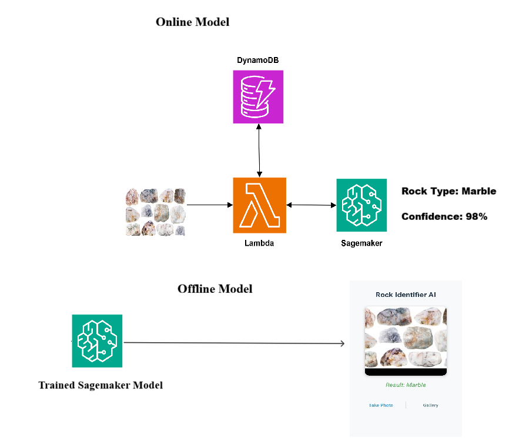

# RockSense AI: Hybrid Cloud-to-Edge Geological Classification 🪨⚡

**RockSense AI** is a professional-grade computer vision platform designed for the mining and geology sectors. We bridge the gap between high-powered cloud analysis and zero-connectivity field work.

[](https://aws.amazon.com/sagemaker/)
[](https://pytorch.org/)
[](https://opensource.org/licenses/MIT)

---

## 🚀 The Vision: Precision Without Connectivity
In the field—whether it's the Eastern Desert or deep underground—internet is non-existent. RockSense AI evolved from **Amazon Rekognition** prototypes into a custom **Amazon SageMaker** hybrid pipeline to provide:
1. **Instant Offline ID:** On-device **PyTorch Mobile (`.ptl`)** inference for real-time results.
2. **Cloud Forensic Audit:** Professional verification via high-precision **PyTorch (`.pth`)** models hosted on SageMaker.

## 🧠 The 18 Rock Labels
Our model is specifically trained to identify and distinguish between 18 geological classes:
* **Igneous:** Andesite, Basalt, Granite, Igneous, Olivine-Basalt.
* **Sedimentary:** Chert, Clay, Coal, Conglomerate, Diatomite, Gypsum, Sandstone, Sedimentary, Shale-(Mudstone), Siliceous-Sinter.
* **Metamorphic:** Marble, Metamorphic, Slate.

---

## 🛠 Technical Architecture



Our architecture follows the AWS Well-Architected Framework:

### 1. The Online Pipeline (Verification)
`User` -> `Amazon API Gateway` -> `AWS Lambda` -> `Amazon SageMaker Endpoint`
* **Purpose:** High-precision "Gold Standard" verification.
* **Tech:** Custom **`.pth`** models trained on GPU-optimized instances (`ml.g4dn`).

### 2. The Offline Pipeline (Edge)
`Mobile APK` <-> `On-Device PyTorch Mobile Model`
* **Purpose:** Zero-latency field classification.
* **Tech:** SageMaker-trained `.pth` models scripted and optimized into **`.ptl`** binaries for mobile CPU/GPU inference.

---

## 🛠 Model Transformation Script
To bridge the gap between our **Amazon SageMaker** training environment and our **Offline Android APK**, we use the following distillation script. This process converts the full-precision PyTorch weights (`.pth`) into an optimized Lite Interpreter format (`.ptl`).

### `export_to_mobile.py`
```python
import torch
import torch.nn as nn
from torchvision import models
from torch.utils.mobile_optimizer import optimize_for_mobile

# 1. SETUP: Rebuild the EfficientNet-B0 architecture
# This architecture is optimized for 18 specific geological classes
print("Initializing architecture...")
device = torch.device("cpu")
model = models.efficientnet_b0()
num_ftrs = model.classifier[1].in_features
model.classifier[1] = nn.Linear(num_ftrs, 18) 

# 2. LOAD SAGEMAKER WEIGHTS
# Loading the .pth file generated by the SageMaker training job
try:
    model.load_state_dict(torch.load('model.pth', map_location=device))
    model.eval()
    print("✅ SUCCESS: Trained SageMaker weights loaded.")
except Exception as e:
    print(f"❌ ERROR: Could not load weights. {e}")

# 3. CONVERT TO MOBILE FORMAT (TorchScript)
print("Optimizing for Android Field Deployment...")
# Using Scripting for EfficientNet (most robust for mobile deployment)
scripted_model = torch.jit.script(model)
optimized_model = optimize_for_mobile(scripted_model)

# 4. SAVE FOR LITE INTERPRETER
filename = "rock_model_final.ptl"
optimized_model._save_for_lite_interpreter(filename)
print(f"🚀 DONE! '{filename}' is ready for the RockSense APK.")
```

---

## 📂 Repository Structure
* `model.tar.gz`: The SageMaker archive containing the training weights (**`model.pth`**).
* `Project-Diagram.png`: Architecture diagrams and technical specifications.
* `MODEL_CARD.md`: Detailed scientific specifications of the AI model.

---

## 📥 Getting Started

### 📱 Mobile Field App (Beta)
Click the button below to download the latest offline-ready APK.

[](YOUR_GOOGLE_DRIVE_LINK_HERE)

* **Step 1:** Enable "Install from Unknown Sources" in your Android device settings.
* **Step 2:** Grant **Camera Access** to allow the model to process live geological samples.
* **Step 3:** Start identifying rocks instantly—**100% Offline.**

### 🧠 Model Assets (Developer Access)
* **Cloud Weights:** [`model.pth`](YOUR_LINK_HERE) (Full-precision SageMaker weights)
* **Mobile Weights:** [`model.ptl`](YOUR_LINK_HERE) (Optimized Lite interpreter version)

---

## 🏆 Project Evolution
- **Phase 1 (MVP):** Prototyped using **Amazon Rekognition** for general feature identification.
- **Phase 2 (Current):** Custom PyTorch training on **Amazon SageMaker** to handle 18 specific geological textures.
- **Phase 3 (Scaling):** Expanding datasets and refining "Forensic Grade" cloud audit capabilities.

---

## ⚖️ License
This project is licensed under the MIT License.

## 🤝 Contact & Community
- **Founder:** Mojahid Daffallah
- **LinkedIn:** https://www.linkedin.com/in/mojahid-daffallah
- **Tags:** #RockClassifierAI #AWS #SageMaker #PyTorch #GeologyAI #MiningTech
